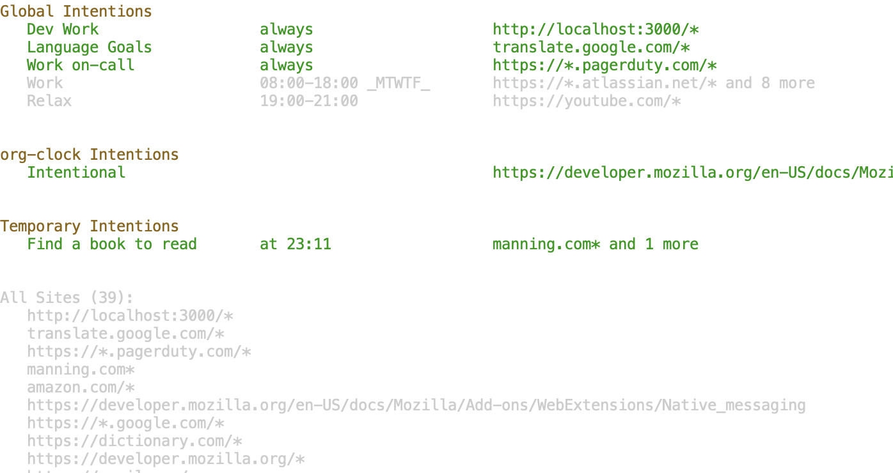

## Intentional: An Emacs/org-mode powered focus-oriented website blocker

Life's most valuable resource is time.  This would imply that the
second most valuable resource is attention, or our capacity to extract
the resource of time according to what we intend.

Over the years I've noticed myself mindlessly browsing the internet.
As if possessed, my fingers would suddenly spring into action:
<kbd>C-t</kbd> <kbd>t</kbd> <kbd>w</kbd> <kbd>i</kbd> <kbd>RET</kbd>
or perhaps <kbd>C-t</kbd> <kbd>n</kbd> <kbd>e</kbd> <kbd>w</kbd>
<kbd>s</kbd> <kbd>C-n</kbd> <kbd>C-n</kbd> <kbd>C-n</kbd>
<kbd>RET</kbd>. But these keybindings, unlike the ones I use in Emacs,
never lead me to where I'd like to be.

Over the years I've tried several ways to protect myself from the
side-effects of these keybindings.  **The problem is that not every
website should be blocked all the time.** I came to the conclusion
that any website can be good to visit if the impetus came from within.
Even Twitter, YouTube, and the other "time-wasting" websites have
their valid uses.

This package is an effort to create such a blocker that allows
websites based on certain "intentions": these intentions can come from
the current clocked task, they can be made on the fly, they can be
pre-programmed to be active at certain times.  For example, a new
org-mode property called `:INTENTIONAL_ALLOW:` contains a list of
website patterns that you want to be allowed when the task is clocked
in.

## Features



In the screenshot above you can see three sections for the three types
of *intentions*. The first are *global intentions*. These are list of
items that you want unblocked at certain times.  Sometimes you always
will want site blocked, sometime only during certain times on certain
days.

The next are org-clock related items. Intentional is able to extract
items from your currently clocked task and have them unblocked
automatically. It will also look at the clocked-in item for any URLs
and it will unblock those as well.  This means that you can make a
list of items to be read, clock into the task, and all of those items
will be unblocked.  Pressing <kbd>c</kbd> in the `*intentional*`
buffer will prompt the user to add a new item to the currently clocked
item which will be added to the `:INTENTIONAL_ALLOW:` property. You
can also specify allow lists for special tags.

The last area is for *temporary intentions*. Here with the press of
<kbd>t</kbd>, you will be prompted to create a new *intention*.  This
will let you easily address any ad-hoc items that come your way.
org-journal is incorporated with the temporary intention list so if
you like, you can have each *temporary intention* you add be added you
the org-journal item for the day.

You can also assign groups of intentions to particular names, so for
example, you can list a bunch of sites to the name "clojure", so
whenever you allow the site "clojure" it will allow all of the items
in the specified groups.

There is also a plugin implementation that is pretty bare-bones but it
gets the job done.  With it, a screen will obstruct the website if it
is not allowed.

## Installation

> NOTICE: Installing the Elisp library is pretty trivial. Currently
> installing the browser extension is tricky as you have to use a
> application as an intermediary to read a file on your computer. I
> intend to make installation easier but the current installation
> process involves quite a few steps, so be warned.

Due to how browsers work, there are a few steps involved to sending
data directly to your browser and thus the setup involves three
components: the elisp library, the data sending intermediary program,
and finally the browser extension.

The Elisp package writes data to the json file `browse-intentions.json`. The browser then periodically calls an add which reads this file and gives it back to the browser.


### Installing the Elisp Package

Since the Elisp file is not on MELPA yet, you will need to install
this manually.  Add the *intentional.el* file to your load path (ex. `(add-to-list 'load-path "~/path/to/file")`) then require it with `(require 'intentional)`. You can change the location of where the configuration file is located by setting `intentional-output-file`. This file's location will be used when setting up the extension.


### Installing the extension

Since extensions executing arbitrary code on your computer is generally not a safe idea, there are a few hoops we have to jump through to get this to work. The extensions are found in the "extensions" sub-directory of this repository. I haven't published them so you'll have to do a manual installation. The following is the manual steps for installing the extensions:

Chrome Instructions:
1. Navigate to `chrome://extensions` and install the extension via "Load unpacked".
2. Take note of the newly generated extension ID (it will look something like "nbfkegdkhebpjgigffjjbeeehddcgioe")
3. Copy the file `./extensions/intentional-chrome/app/intentional.py` to somewhere on your path. Replace the string in the code `'/Users/YOUR_USER/browse-intentions.json'` with where you intend to store the configuration file.
4. Run `chmod +x /path/to/intentional.py` to give execution permission to the file.
5. In `./extensions/intentional-chrome/app/com.zkry.intentional.json` replace PATH-TO-APPLICATION to where you stored the Python file, and CHROME-EXTENSION-ID-HERE with the id copied in step 2 and copy this file to the path `/Users/zromero/Library/Application Support/Google/Chrome/NativeMessagingHosts` (see [here](https://developer.chrome.com/apps/nativeMessaging#native-messaging-host-location) for more details).
6. On the extension page, press the reload button and everything should be set.

FireFox Instructions:
1. You will need to have a developer version of Firefox. Set the `xpinstall.signatures.required` flag to false in `about:config`. You can now package and install the extension under `./extensions/intentional-firefox/`. You can also install this temporarily on the `about:debugging` tab.
2. Copy the file `./extensions/intentional-firefox/app/intentional.py` to somewhere on your path. Replace the string in the code `'/Users/YOUR_USER/browse-intentions.json'` with where you intend to store the configuration file.
3. Run `chmod +x /path/to/intentional.py` to give execution permission to the file.
4. In the `~/Library/Application Support/Mozilla/NativeMessagingHosts/` directory, put the `./extensions/intentional-firefox/app/intentional.json` file.
5. The Firefox extension should now be working properly. Refresh it if it has an error in `about:debugging`.


## Usage

Run the command <kbd>M-x</kbd> intentional <kbd>RET</kbd> to open the intention listing screen. Here you will see the three sections: Global Intentions, org-clock Intentions, and Temporary Intentions.

### Setting up Global Intentions

The variable `intentional-global-intentions` controls the list of
global intentions. it is a list of lists of the form `(NAME TIME-SPEC SITE-LIST)`.

- `NAME` is the name the intention will show as.
- `TIME-SPEC` can be the following:
  - The symbol `always`
  - A list `(between BEGIN-TIME-STR END-TIME-STR)` where the time strings are 24h time strings.
  - A list `(between-on-days BEGIN-TIME-STR END-TIME-STR DAYS-LIST)`
    - The `BEGIN-TIME-STR` and `END-TIME-STR` are 24h time strings.
    - DAYS-LIST is a list of numbers representing the days of the week
      (0 = Sunday, 1 = Monday, etc.)  the intention should be
      considered.

The following is an example:

``` emacs-lisp
(setq intentional-global-intentions
  '(("Language Goals" always ("translate.google.com/*"))
    ("Work on-call" always ("https://*.pagerduty.com/*"))
    ("Work" (between-on-days "08:00" "18:00" (1 2 3 4 5))
     ("https://*.atlassian.net/*"
      "https://github.com/*"
      "https://outlook.office.com/*"
      "https://golang.org/*"
      "https://*circleci.com/*"
      "https://accounts.google.com/*"
      "googleusercontent.com/*"
      "codeclimate.com/*"))
    ("Relax" (between "19:00" "21:00") ("https://youtube.com/*"))))
```

### Setting up org-clock Intentions

Org-clock integration is automatic. You should see the name of the
currently clocked in task in the Intentional buffer. To add a site
pattern, just press <kbd>c</kbd>. This will prompt you for the site
pattern that you want to be allowed for the task.  Entering a site
will write this site to the `INTENTIONAL_ALLOW` org-property on the item.

#### Setting up intention tags

You can set up Intentional so that if a task has a particular tag, it
will allow a set of sites. This is controlled by the
`intentional-tag-intentions` variable and can be set as follows.

``` emacs-lisp
(setq intentional-tag-intentions
  '(("shopping" ("amazon.com/*" "amazon.de/*"))
    ("deepwork" ("mynoise.net/*"))))
```

#### Automatically allowing URLs in body.

By setting the variable `intentional-extract-clock-body-urls` to
non-nil, Intentional will look for any URLs in the body of the current
clocked in task and allow all of those sites.

### Setting up local intentions

By pressing <kbd>t</kbd> in the Intentional buffer, you will be
prompted for a name, expiration, and site pattern for an allowed item.
The expiration can be a duration string like "10min" or "1h" or a time
like "17:32".

Pressing <kbd>a</kbd> when your pointer is on a temporary intention
will allow you to add a site to the temporary intention.

Pressing <kbd>m</kbd> when your pointer is on a temporary intention
will allow you to modify the last site entered.

Pressing <kbd>d</kbd> will delete the temporary intention where the
point is located.

#### Saving to journal

If you have org-journal set up, you can have intentional write your
added temporary intentions by setting `intentinoal-save-to-journal` to
non-nil.

### Setting up group names

Instead of having to type many lists of sites repeatedly, when adding
a site you can refer to a group which refers to many sites. You can set a group as follows:

``` emacs-lisp
(setq intentional-site-groups
      '(("work" "https://*.atlassian.net/*" "https://github.com/*" "https://outlook.office.com/*" "https://golang.org/*" "circleci.com/*")
        ("clojure" "https://clojuredocs.org/*" "https://clojure.org/*" "https://cljdoc.org/*" "https://github.com/*" "https://clojureverse.org/*" "https://stackoverflow.com/*")
        ("golang" "https://golang.org/*" "https://github.com/*" "https://godoc.org/*" "https://stackoverflow.com/*")))
```

This is a list of lists whose first element is the name of the group and rest ii a list of allowed sites.


## Example Configuration

``` emacs-lisp
(require 'intentional)

(setq intentional-output-file "~/browse-intentions.json")

(setq intentional-global-intentions
      '(("Language Goals" always ("translate.google.com/*"))
        ("Work on-call" always ("https://*.pagerduty.com/*"))
        ("Work" (between-on-days "08:00" "18:00" (1 2 3 4 5))
         ("https://*.atlassian.net/*"
          "https://github.com/*"
          "https://outlook.office.com/*"
          "https://golang.org/*"
          "https://*circleci.com/*"
          "https://accounts.google.com/*"
          "googleusercontent.com/*"
          "travelaudience.com/*"
          "codeclimate.com/*"))
        ("Relax" (between "19:00" "21:00") ("https://youtube.com/*"))))

(setq intentional-site-groups
      '(("work" "https://*.atlassian.net/*" "https://github.com/*" "https://outlook.office.com/*" "https://golang.org/*" "travelaudience.com/*" "circleci.com/*")
        ("clojure" "https://clojuredocs.org/*" "https://clojure.org/*" "https://cljdoc.org/*" "https://github.com/*" "https://clojureverse.org/*" "https://stackoverflow.com/*")
        ("golang" "https://golang.org/*" "https://github.com/*" "https://godoc.org/*" "https://stackoverflow.com/*")))

(setq intentional-tag-intentions
      '(("shopping" ("amazon.com/*" "amazon.de/*"))
        ("deepw" ("mynoise.net/*"))))

(setq intentional-save-to-journal nil)

(setq intentional-extract-clock-body-urls t)
```
